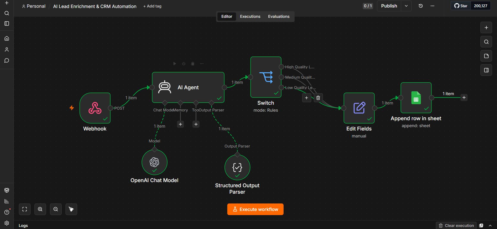

# 🤖 AI Lead Enrichment & CRM Automation

> An AI-powered lead qualification and CRM automation workflow built with **n8n, OpenAI, Webhooks, Structured Outputs, and Google Sheets**.



---

## 📌 Project Overview

Businesses receive leads from multiple sources, but manually reviewing, qualifying, prioritizing, and organizing those leads can consume valuable time and cause high-quality opportunities to be missed.

This project demonstrates an automated AI-powered lead qualification pipeline.

The workflow receives a lead through a **Webhook**, sends the lead data to an **AI Agent**, evaluates the lead using structured criteria, classifies its quality and priority, determines whether it represents a good opportunity, generates a reason and recommended next action, and finally stores the processed lead in **Google Sheets**.

The result is a structured CRM-ready lead record that can be used by sales teams for faster qualification and follow-up.

### 💼 Business Impact

Instead of manually reviewing every incoming lead, a sales team can receive a structured qualification for each prospect automatically.

The workflow helps sales teams:

- Identify high-priority opportunities faster.
- Separate promising leads from low-intent prospects.
- Standardize the qualification process.
- Reduce repetitive manual data entry.
- Give sales representatives a clear recommended next action.
- Create a consistent foundation for future CRM and follow-up automation.

The goal is not to replace the sales team, but to give them better information earlier in the sales process.

---

## 🎯 Business Problem

A typical sales process may require a team member to manually:

1. Read incoming lead information.
2. Understand the prospect's business need.
3. Estimate buying intent.
4. Determine lead quality.
5. Assign a priority.
6. Decide whether the opportunity is worth pursuing.
7. Write notes explaining the decision.
8. Decide what action should happen next.
9. Enter the information into a CRM or spreadsheet.

When lead volume increases, this process becomes repetitive, inconsistent, and difficult to scale.

### This automation transforms:

**Raw Lead → AI Analysis → Qualification → Prioritization → CRM Record**

---

# 🧠 What the Automation Does

The workflow performs the following operations:

- Receives lead data through a Webhook.
- Sends the lead to an AI Agent.
- Uses an OpenAI Chat Model for intelligent analysis.
- Produces a structured AI response.
- Classifies the lead as:
  - `High`
  - `Medium`
  - `Low`
- Determines lead priority.
- Determines whether the lead is a good opportunity.
- Generates an explanation for the classification.
- Generates a recommended next action.
- Routes the result using a Switch node.
- Normalizes the final data using Edit Fields.
- Appends the processed lead to Google Sheets.

---

# 🏗️ Workflow Architecture

```text
                    ┌──────────────────┐
                    │     Webhook      │
                    │   Lead Intake    │
                    └────────┬─────────┘
                             │
                             ▼
                    ┌──────────────────┐
                    │    AI Agent      │
                    │ Lead Analysis    │
                    └────────┬─────────┘
                             │
              ┌──────────────┴──────────────┐
              │                             │
              ▼                             ▼
      ┌─────────────────┐        ┌─────────────────────┐
      │ OpenAI Chat     │        │ Structured Output   │
      │ Model            │        │ Parser              │
      └─────────────────┘        └─────────────────────┘
                             │
                             ▼
                    ┌──────────────────┐
                    │      Switch      │
                    │  Lead Quality    │
                    └────────┬─────────┘
                             │
              ┌──────────────┼──────────────┐
              ▼              ▼              ▼
           High           Medium           Low
              │              │              │
              └──────────────┼──────────────┘
                             │
                             ▼
                    ┌──────────────────┐
                    │    Edit Fields   │
                    │ Data Normalizing  │
                    └────────┬─────────┘
                             │
                             ▼
                    ┌──────────────────┐
                    │   Google Sheets  │
                    │    CRM Storage   │
                    └──────────────────┘
